Digital Filter design and Analysis with Python
==============================================
[](https://github.com/ooshyun/FilterDesign/blob/master/LICENSE)

This Project contains mainly two parts, which are filter design and utiliy usage when understanding and implementing filter.

Filter Filter design and analysis
---------------------------------

What is a filter in the signal? Filter can be used to remove unwanted noise or unwanted signal, to modify the signal, to imitate new signal, 
or analyze the meaning in the signal such as brain wave. In this part, we will design this filter using several methods and this is specifically for the signal from wav file while using music, recording, and streaming phone call.

Filter can be basically designed as fir and iir as single filter. In this case it has several options to design the filter.
such as Q factor, Bandwidth, Amplitude, Phase, etc. (If you want to know more about it, please check the link^[1](https://ccrma.stanford.edu/~jos/fp/Book_Series_Overview.html)). This project is for plotting the transfer function and processing the signal from wav file while using several filter.

This part is written in **main.py**, and the contents is as below,

1. <span style="font-size:120%">Single filter design
    
    A filter has several forms, which are lowpass, highpass, bandpass, allpass notch, peaking, and shelf. In this case,
    it will design using biquied form transfer function. The filter_plot can be used to plot these kinds of filter,
    and show the frequency response, phase response, and poles and zeros. The filter process can show how to process the signal in wav file, and
    make the wav file specific path. (If you want to know more about it, please check the [path](docs/txt/Audio-EQ-Cookbook.txt), it referred following link)^[2](https://webaudio.github.io/Audio-EQ-Cookbook/Audio-EQ-Cookbook.txt)

        - filter_plot
        - filter_process

2. <span style="font-size:120%"> Serial structure of filters design
    
    Serial structure of filters, which is also called Parametric Equalizer in the music field. "Parametric" means it will use biquid(especially two zeros and
    two poles) form transfer function. This follows the steps like single filter design, which are plot and process. 

        - serial_equalizer_plot
        - serial_equalizer_process

3. <span style="font-size:120%"> Parallel structure of filters design
    
    Parallel structure of filters, which is also called Graphical Equalizer in the music field. It designed this combination of filters using least square method in the real impulse response and also include the complex impulse response(but it commented in the part of computation). This follows the steps like single filter design, which are plot and process. Before understanding, it provides the test vector using generator_test_vector_grahpical_equalizer function.
    This part is based on Paper. "Efficient Multi-Band Digital Audio Graphic Equalizer with Accurate Frequency Response Control"
    
    - generator_test_vector_grahpical_equalizer
    - parallel_equalizer_plot
    - parallel_equalizer_wav_process

4. <span style="font-size:120%"> Analyze filter
    
    This part integarate single, serialm and parallel filters design. It will plot the transfer function, phase response, and poles and zeros
    for analying each of the filters.

    - analyze_filter

Utility for understanding and implementing filter
---------------------------------------------------------

The contents is as below,
1. <span style="font-size:120%"> Fi command example between fixed and floating format parameter test

    When computing several filters in restricted enviroment such as embedded device, it need to consider the format of the parameter. This part provides
    the example of fixed format and converting between floating and fixed format using fi command imitating Matlab fi command.

    - example_fi
    - iir_filter_fixed_to_floating_format_plot
    - iir_filter_float_ng_to fixed_format_print
    - iir_filter_fixed_to_floating_format_process
    
2. <span style="font-size:120%"> Logarithmic scale

    This part is used to plot the logarithmic scale of the frequency response.

    - scale_logarithmic

3. <span style="font-size:120%"> Analying the difference between digital and analog

    This part is used to understand how to plot digital and analog filter, and connect to know the difference between digital and analog filter.

    - paper_plot_sheving_filter_digital
    - paper_plot_sheving_filter_analog

4. <span style="font-size:120%"> Frequency wrapping 

    This part contains the frequency wrapping referring to frequency-warped signal preprocessing for audio application, 2000.
    - paper_all_pass_filter

Result
------

This part contains the simulation result of the filter design and analysis, and the result of [wav file](test/result/wav/). When analyzing the result, it used Audacity to make a frequency response. It tested the each type of filer with white noise since representing expected frequency response well. The original frequency response in Audacity's frequency response is as below,

---
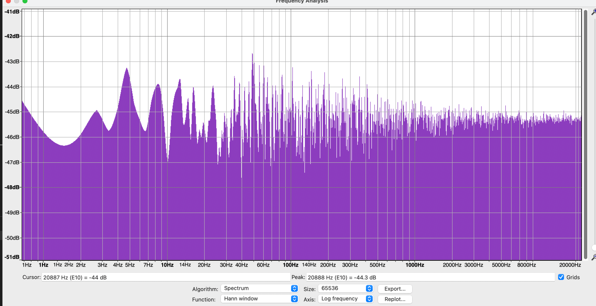
---

I designed **single filter such as peaking and shelving form, serial structure of 3 peaking filters and parallel structure of filters which frequency is located with logarithmic scale**. The results constitute filter parameter, expected [frequency response and wav file response](test/result/img/). The wav file can be seen in [this path](test/result/wav). You can also make the this result using **main.py**. I attached the results as below,

### Single filter design

- **Peaking filter**
	
	1. Filter parameter
		
			Q = 1/sqrt{2}
			gain = 6 (dB)
			fc = 1033 (Hz)
		*fc = cut-off frequency
	
	2. Frequency response in simulation
	
		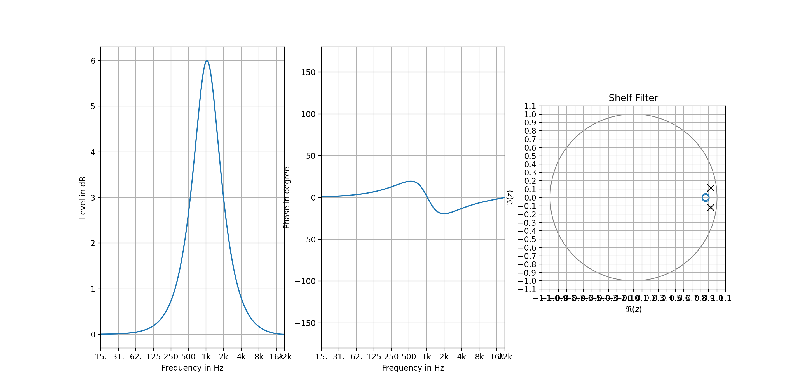
	
	3. Frequency response in Audacity	
	
		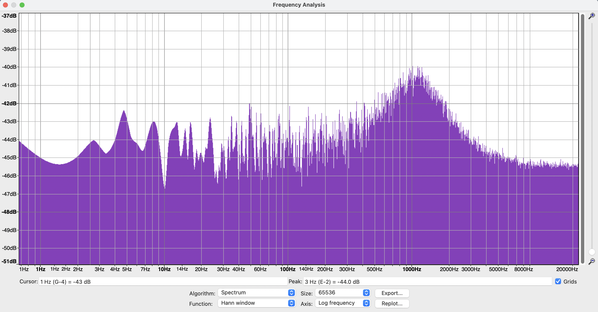

- **Shelving filter**
		
	1. Filter parameter
		
			Q = 1/sqrt{2}
			gain = 6 (dB)
			fc = 1033 (Hz)
		
	2. Frequency response in simulation
	
		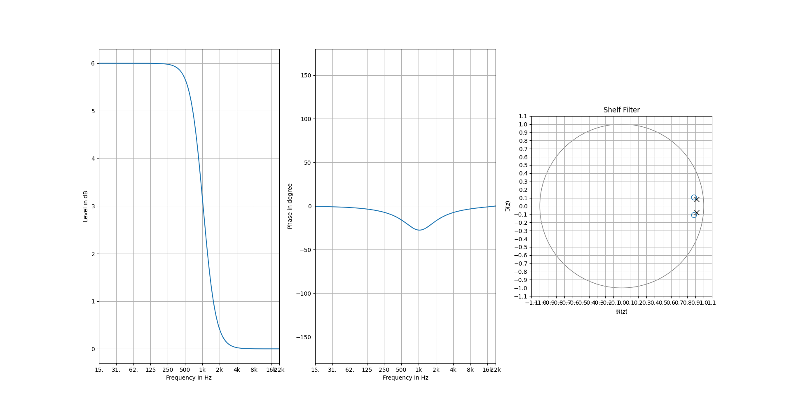
	
	3. Frequency response in Audacity	
	
		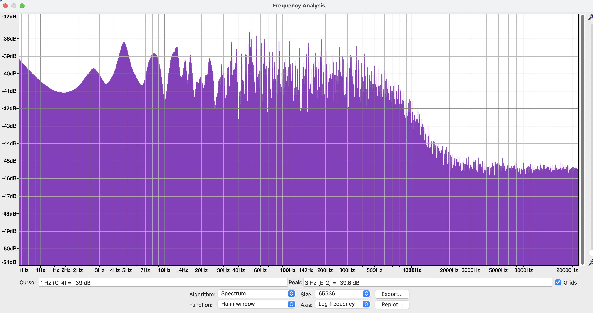

###  Serial structure of filters design

- **Three peaking filters**
	
	1. Filter parameter
		
			Q = 4
			gain = 12 (dB)
			fc = 1000, 4000, 8000 (Hz)
		
	2. Frequency response in simulation
	
		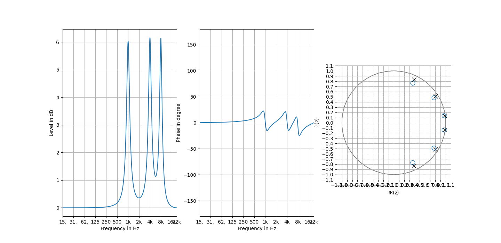
	
	3. Frequency response in Audacity	
	
		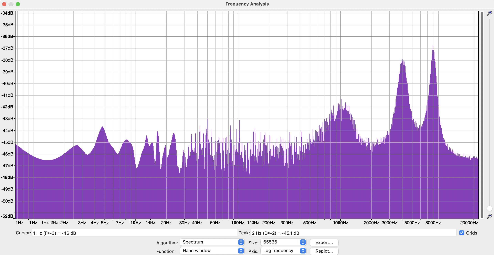

### Parallel structure of filters design

-  **32 band**

	1. Filter parameter
	
		[Test case](test/data/json/test_graphical_equalizer.json) 1, test_gain 2, ["1"]["test_gain"][1]
		
	2. Frequency response in simulation
	
		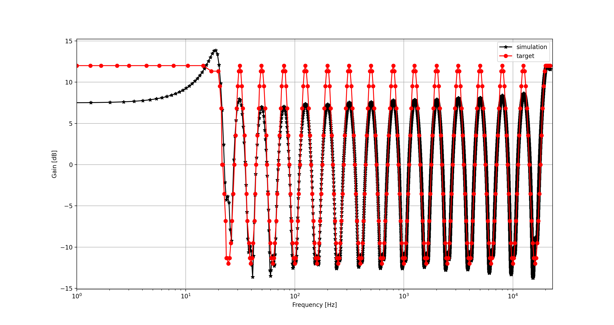
	
	3. Frequency response in Audacity	
	
		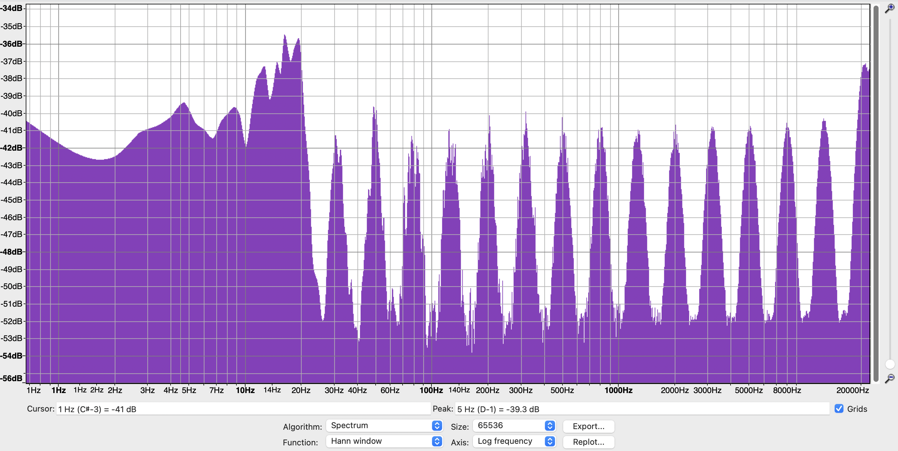	

- **64 band**
	
	1. Filter parameter
		
		[Test case](test/data/json/test_graphical_equalizer.json) 2, test_gain 2, ["2"]["test_gain"][1]

		
	2. Frequency response in simulation
	
		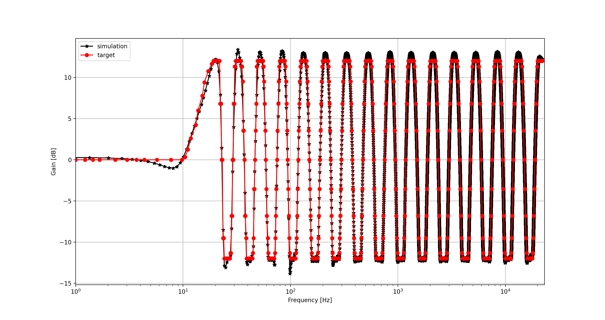
	
	3. Frequency response in Audacity	
	
		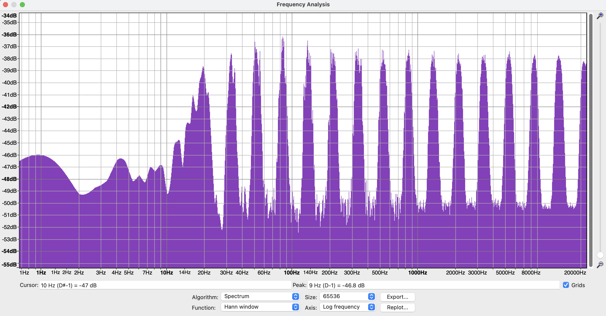

Citation
--------
If any question, ask or contact to me!

```bibtex
@article{,
  title={Digital Filter Design for Audio and Speech Processing},
  author={Seunghyun Oh},
  year={2022}
}
```
